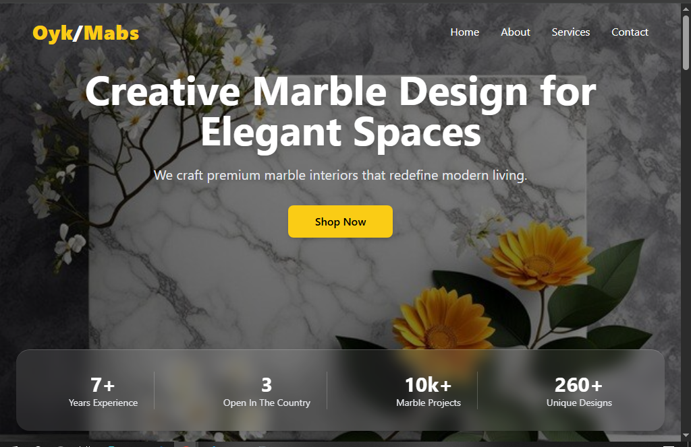

Oyk/Mabs Marble Designs

Live Demo

🔗 https://marbles-chi.vercel.app

Project Overview

Oyk/Mabs Marble Designs is a modern, responsive web platform built with React, Vite, and Tailwind CSS, crafted to showcase premium marble products and interior-design services.
The project emphasizes:

Elegant and professional interface

Reusable, scalable component architecture

High-quality imagery

Smooth responsiveness across all devices

Strong visual identity and branding

Brand Identity
🎨 Color System
Role Color HEX
Primary Gold #FACC15
Secondary White #FFFFFF
Accent Black #000000

Rationale:
Gold and white reflect luxury and purity, while black adds depth and contrast.

🔤 Typography
Category Style Reasoning
Headings Bold, wide tracking Strong premium branding
Body Text Neutral gray High readability across devices
Design Decisions

Mobile-first design approach

Hero section with strong visual hierarchy

Reusable yellow CTA buttons

Soft glass-effect cards

Tailored breakpoints for real device sizes

Clean spacing and consistent layout rules

Component Architecture

All components are located in:

src/components/

Core Components

Header.jsx

Hero.jsx

Marbles.jsx

Products.jsx

Features.jsx

Testimonial.jsx

Newsletter.jsx

Footer.jsx

Button.jsx

Cards.jsx

Reusability Strategy

Buttons, cards, and layout containers are built as reusable components to ensure long-term scalability and consistent styling.

Performance Optimizations

Compressed and optimized images

Removed unused imports and dead code

Lazy-loaded heavy UI sections

Tailwind JIT generates minimal CSS

Cached assets for faster reloads

Image Credits

(Add proper attribution after confirming your sources)

Marble imagery —

Background assets —

Installation & Setup

# Clone the repository

git clone <your-repo-url>

# Enter project folder

cd ps

# Install dependencies

npm install

# Start development server

npm run dev

Technologies Used
Technology Version Purpose
React 18+ UI library
Vite Latest Build tool / bundler
TailwindCSS 3+ Styling
ESLint Latest Linting / code quality
JavaScript ES6+ App logic
Challenges & Solutions

1. Case-Sensitivity Import Errors

Windows created mismatching lowercase/uppercase import paths.
✔ Solution: Removed incorrect files + reset Vite cache.

2. Mobile Navigation Overlap

Navigation overlapped on small devices.
✔ Solution: Adjusted padding, flex configuration, and breakpoints.

3. Hero Image Distortion

Background image stretched incorrectly.
✔ Solution: Replaced with HD image + Tailwind background utilities.

Future Improvements

Framer Motion animations

Backend API integration

User authentication

Dark Mode theme

Deployment on Vercel/Netlify

Functional newsletter backend

Screenshots

(Add actual screenshots inside /screenshots folder once ready)

Recommended structure:

/screenshots
hero-lg.png
marbles-md.png
features-sm.png
lighthouse-report.png

License

This project is for educational and portfolio purposes.
Attribution is appreciated when reused.

---

# 📸 Screenshots

### 🖥️ Desktop View

### 📱 Mobile View

### 💻 Tablet View

